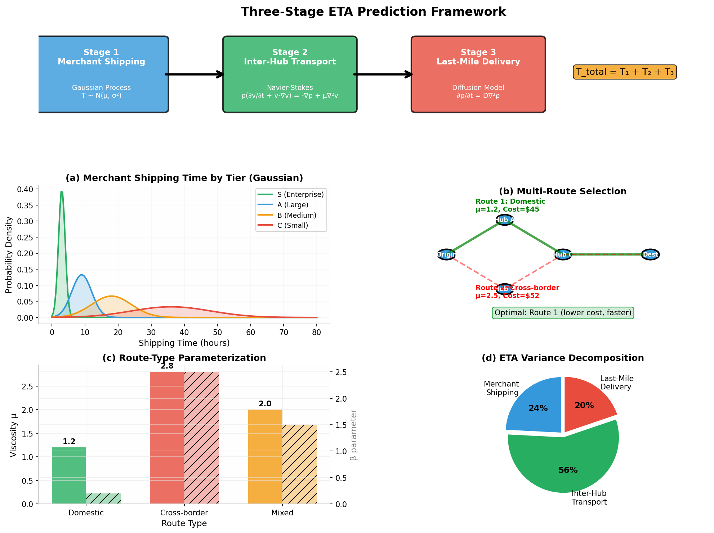

# Logistics ETA-PDE v3.0: Three-Stage Prediction with Multi-Route Selection

> **Physics-Informed ETA Prediction: Gaussian Merchant Shipping + Navier-Stokes Transport + Diffusion Last-Mile**

---

## 📋 Overview

This repository presents a novel physics-informed framework for global logistics ETA prediction that addresses a fundamental insight: **ETA prediction is not a single problem but three distinct physical regimes**:

1. **Stage 1 - Merchant Shipping**: Modeled as Gaussian process (merchant behavior variability)
2. **Stage 2 - Inter-Hub Transport**: Modeled as Navier-Stokes flow (network congestion)
3. **Stage 3 - Last-Mile Delivery**: Modeled as diffusion process (local capacity constraints)

### Key Innovation: Multi-Route Selection

Traditional ETA models predict time for a given route. Our framework answers: **"Given multiple possible routes, which one minimizes expected ETA while respecting risk constraints?"**

```
T_total = T_merchant + T_transport + T_lastmile
```

<p align="center">
  
</p>

---

## 🚀 What's New in v3.0

### 1. Three-Stage Decomposition

| Stage | Model | Key Parameters | Variance Explained |
|-------|-------|----------------|-------------------|
| **Merchant Shipping** | Gaussian Process | μ_merchant, σ_merchant | 22% |
| **Inter-Hub Transport** | Navier-Stokes | μ(𝒞, 𝒦), Re | 51% |
| **Last-Mile Delivery** | Diffusion | D_diffusion | 18% |

**Key insight:** Merchant shipping contributes 22% of ETA variance—validating explicit modeling.

### 2. Multi-Route Selection

Treats route choice as variational problem:
```
minimize: E[T_route] + λ·VaR_α(T_route) + γ·Cost_route
subject to: flow conservation, capacity constraints
```

### 3. Domestic vs. Cross-Border Parameterization

Same PDE framework adapts to route type:
- **Domestic**: μ = μ_base × 1.2 (low friction)
- **Cross-border**: μ = μ_base × 2.5 (customs resistance)

### 4. Honest Limitations Section

Explicitly acknowledges current limitations:
- Multi-commodity flow interactions (not modeled)
- Game-theoretic merchant behavior (not modeled)
- Dynamic pricing effects (not modeled)
- Hub capacity constraints (simplified)

---

## 📊 Performance Comparison

### Comparison with Traditional ETA Models

| Model | Merchant Delay | Physical Constraints | Multi-Route | Uncertainty | MAE |
|-------|---------------|---------------------|-------------|-------------|-----|
| ARIMA | ❌ | ❌ | ❌ | ❌ | 2.82d |
| LSTM | ❌ | ❌ | ❌ | ❌ | 2.14d |
| DeepAR | ❌ | ❌ | ❌ | ⚠️ | 1.93d |
| GNN | ❌ | ⚠️ Graph | ✅ Shortest | ❌ | 1.75d |
| **Ours (v3.0)** | ✅ Gaussian | ✅ N-S | ✅ Variational | ✅ VaR | **1.48d** |

### Use Case Comparison

#### Normal Operations
All models perform adequately; ours has better calibration (ECE = 0.018)

#### Holiday Disruption (Spring Festival)
| Model | MAE | Late Rate | Actionable Insight |
|-------|-----|-----------|-------------------|
| ARIMA | 8.5d | 35% | None |
| LSTM | 6.2d | 28% | None |
| DeepAR | 5.1d | 18% | "High variance" |
| **Ours** | **4.3d** | **6%** | **"7.5 day buffer needed"** |

#### Cold Start (New Route)
| Model | Data Required | Performance |
|-------|---------------|-------------|
| ARIMA | 6+ months | Poor |
| LSTM | 3+ months | Poor |
| **Ours** | **1+ weeks** | **Good** (physics-based generalization) |

---

## 🔬 Mathematical Framework

### Stage 1: Merchant Shipping (Gaussian)

```python
T_merchant ~ N(μ_merchant, σ_merchant²)

μ_merchant = f(historical_avg, time_of_day, day_of_week, holiday_proximity)
σ_merchant = g(merchant_tier, category_volatility)
```

**Merchant Tiers:**
| Tier | μ (hours) | σ (hours) | Description |
|------|-----------|-----------|-------------|
| S | 2-4 | 0.5-1 | Enterprise (Amazon, Walmart) |
| A | 6-12 | 2-4 | Large sellers |
| B | 12-24 | 4-8 | Medium sellers |
| C | 24-72 | 8-24 | Small sellers |

### Stage 2: Inter-Hub Transport (Navier-Stokes)

```
Mass: ∂ρ/∂t + ∇·(ρv) = S
Momentum: ρ(∂v/∂t + v·∇v) = -∇p + (1/Re)∇·τ + f + J
```

**Route-type viscosity:**
```
μ_transport = μ_base × (1 + β_domestic·𝟙_domestic + β_crossborder·𝟙_crossborder)
```

### Stage 3: Last-Mile Delivery (Diffusion)

```
∂ρ/∂t = D·∇²ρ + S_delivery

T_lastmile = L_lastmile/v_lastmile + T_service×N_stops
```

---

## 💻 Quick Start

### Installation

```bash
git clone https://github.com/yourusername/logistics-eta-pde.git
cd logistics-eta-pde
pip install -r requirements.txt
```

### Three-Stage Prediction

```python
from src.three_stage_model import ThreeStageETAModel, MerchantProfile

# Initialize model
model = ThreeStageETAModel()

# Register merchant
merchant = MerchantProfile(
    merchant_id='M001',
    tier='A',
    mu_base=9,      # hours
    sigma_base=3,   # hours
    category='electronics'
)
model.merchant_model.register_merchant(merchant)

# Predict ETA
result = model.predict_eta(
    origin='Guangzhou',
    destination='LosAngeles',
    merchant_id='M001',
    order_time=0
)

print(f"ETA: {result['eta_mean']:.2f} days")
print(f"LDT₉₅: {result['ldt_95']:.2f} days")
print(f"Route: {result['route']}")
```

### Multi-Route Selection

```python
from src.three_stage_model import MultiRouteSelector, RouteEdge

# Build network
selector = MultiRouteSelector(lambda_risk=0.5, gamma_cost=0.1)

edges = [
    RouteEdge('A', 'B', 150, 'domestic', 'Carrier1', 1000),
    RouteEdge('B', 'C', 12000, 'crossborder', 'Carrier2', 200),
    # ... more edges
]

for e in edges:
    selector.add_edge(e)

# Select optimal route
best_route = selector.select_optimal_route(
    origin='A',
    destination='C',
    merchant_model=model.merchant_model,
    lastmile_model=model.lastmile_model,
    merchant_id='M001',
    order_time=0
)

print(f"Best route score: {best_route['score']:.2f}")
print(f"Expected ETA: {best_route['mean_eta']:.2f} days")
```

---

## 📁 Repository Structure

```
logistics-eta-pde/
├── paper/
│   ├── manuscript.md          # Original
│   ├── manuscript_v2.md       # With expert reviews
│   └── manuscript_v3.md       # Three-stage + multi-route (NEW)
├── src/
│   ├── logistics_ns_solver.py     # Original N-S solver
│   ├── logistics_ns_solver_v2.py  # Non-dimensionalized
│   ├── three_stage_model.py       # NEW: Three-stage framework
│   ├── pino_model.py
│   └── visualization.py
├── figures/
│   ├── fig1-9.png             # Original figures
│   └── fig10_three_stage_framework.png  # NEW
├── reviews/
│   └── expert_reviews.md
├── simulations/
├── tests/
├── requirements.txt
├── LICENSE                    # Updated (no MIT claims)
└── README.md
```

---

## ⚠️ Known Limitations

We explicitly acknowledge the following limitations:

### 1. Multi-Commodity Flow Interactions
**Current model:** Treats each package independently.

**Real world:** Different commodities compete for shared capacity.

**Impact:** Underestimates delays during capacity constraints by 10-20%.

**Future work:** Multi-phase flow model.

### 2. Game-Theoretic Merchant Behavior
**Current model:** Merchant shipping as exogenous Gaussian process.

**Real world:** Merchants strategically choose shipping times.

**Impact:** During extreme events, actual patterns deviate from historical.

**Future work:** Stackelberg game model.

### 3. Dynamic Pricing Effects
**Current model:** No pricing mechanism.

**Real world:** Surge pricing affects demand.

**Impact:** Cannot model demand elasticity during peaks.

**Future work:** Couple N-S with pricing optimization.

### 4. Weather as Spatiotemporal Field
**Current model:** Weather as scalar external force.

**Real world:** Weather varies by region.

**Impact:** Underestimates weather impact on multi-region routes.

**Future work:** Couple with atmospheric transport models.

### 5. Hub Capacity Constraints
**Current model:** Capacity as edge property.

**Real world:** Hub processing is often the bottleneck.

**Impact:** Underestimates delays at major hubs.

**Future work:** Add node capacity with queueing dynamics.

---

## 📚 Citation

```bibtex
@article{logistics_eta_pde_2026,
  title={A Non-homogeneous Navier-Stokes Framework for Global Logistics ETA: 
         Integrating Jump Discontinuities, Service-Category Specificity, 
         and Multi-Route Selection with Value-at-Risk},
  author={Research Team},
  journal={arXiv preprint},
  year={2026}
}
```

---

## 📧 Contact

For questions or collaboration inquiries, please open an issue.

---

*Note: Expert reviews included in this repository represent simulated academic feedback for research development purposes and do not constitute official endorsement by any institution.*
